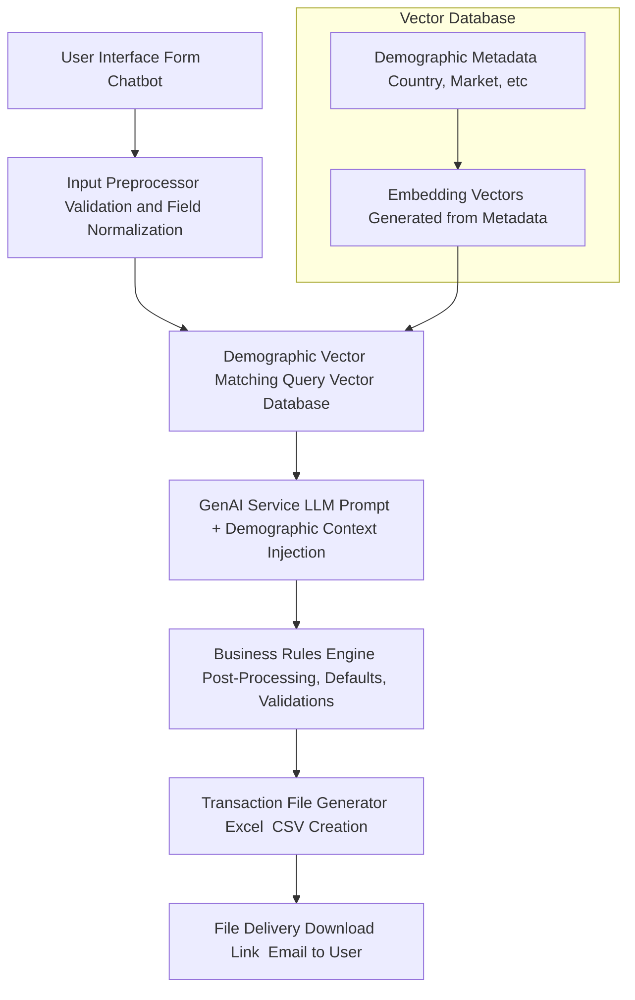

```mermaid
flowchart TD
    A[User Interface Form  Chatbot] --> B[Input Preprocessor Validation and Field Normalization]
    B --> C[Demographic Vector Matching Query Vector Database]
    C --> D[GenAI Service LLM Prompt + Demographic Context Injection]
    D --> E[Business Rules Engine Post-Processing, Defaults, Validations]
    E --> F[Transaction File Generator Excel  CSV Creation]
    F --> G[File Delivery Download Link  Email to User]

    subgraph Vector Database
        V1[Demographic Metadata Country, Market, etc]
        V2[Embedding Vectors Generated from Metadata]
    end
    V1 --> V2
    V2 --> C
```
