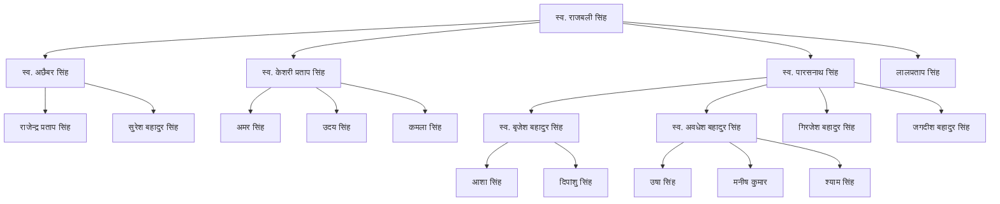

```mermaid

graph TD
    A[स्व. राजबली सिंह]

    A1[स्व. अछैबर सिंह]
    A2[स्व. केशरी प्रताप सिंह]
    A3[स्व. पारसनाथ सिंह]
    A4[लालप्रताप सिंह]

    A --> A1
    A --> A2
    A --> A3
    A --> A4

    A1a[राजेन्द्र प्रताप सिंह]
    A1b[सुरेश बहादुर सिंह]
    A1 --> A1a
    A1 --> A1b

    A2a[अमर सिंह]
    A2b[उदय सिंह]
    A2c[कमला सिंह]
    A2 --> A2a
    A2 --> A2b
    A2 --> A2c

    A3a[स्व. बृजेश बहादुर सिंह]
    A3b[स्व. अवधेश बहादुर सिंह]
    A3c[गिरजेश बहादुर सिंह]
    A3d[जगदीश बहादुर सिंह]
    A3 --> A3a
    A3 --> A3b
    A3 --> A3c
    A3 --> A3d

    A3a1[आशा सिंह]
    A3a2[दिपांशु सिंह]
    A3a --> A3a1
    A3a --> A3a2

    A3b1[उषा सिंह]
    A3b2[मनीष कुमार]
    A3b3[श्याम सिंह]
    A3b --> A3b1
    A3b --> A3b2
    A3b --> A3b3
```
